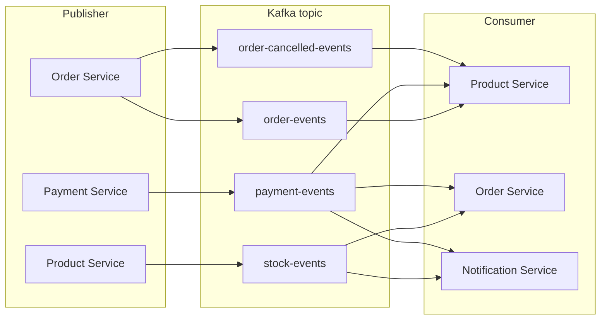

# 🛒 E-Commerce Platform

Scalable e-commerce platform built with **Spring Boot Microservices** and **Spring Cloud**.

## 📚 Table of Contents

- [Architecture](#architecture)
- [Microservices](#microservices)
- [Infrastructure](#infrastructure)
- [Event-Driven Communication with Kafka](#event-driven-communication-with-kafka)
- [Getting Started](#getting-started)
- [Technology Stack](#technology-stack)

## 🏗️ Architecture

This project implements a **microservices architecture** with the following components:

- **API Gateway**: Single entry point for all client requests with JWT authentication
- **Service Discovery**: Eureka server for service registration and discovery
- **Config Server**: Centralized configuration management
- **Microservices**: Independent services handling specific business domains
- **Event Bus**: Apache Kafka for asynchronous communication
- **Databases**: PostgreSQL (relational), MongoDB (document), Redis (caching)

## 🔧 Microservices

| **API Gateway** 
| **Discovery Server** 
| **Config Server** 
| **User Service** 
| **Product Service** |
| **Cart Service** 
| **Order Service** 
| **Payment Service** 
| **Notification Service** 

## 🐳 Infrastructure

**Docker Services** (defined in `docker-compose.yml`):

- **PostgreSQL**: Primary relational database 
- **MongoDB**: Document database for flexible schemas 
- **Redis**: In-memory cache for performance optimization 
- **Kafka**: Message broker for event-driven architecture

## 🎵 Event-Driven Communication with Kafka

The platform uses **Apache Kafka** for asynchronous communication between services:
### Kafka Topics & Event Flow



## 🚀 Getting Started

### Prerequisites

- Docker & Docker Compose
- Java 17+
- Maven 3.8+

### Quick Start

1. **Clone the repository**
   ```bash
   git clone <repository-url>
   cd E-Commerce-platform
   ```

2. **Start infrastructure**
   ```bash
   docker-compose up -d
   ```

3. **Build the project**
   ```bash
   mvn clean build
   ```

4. **Run microservices** (each in separate terminal)
   ```bash
   cd discovery-server && mvn spring-boot:run
   cd config-server && mvn spring-boot:run
   cd api-gateway && mvn spring-boot:run
   cd user-service && mvn spring-boot:run
   cd product-service && mvn spring-boot:run
   cd cart-service && mvn spring-boot:run
   cd order-service && mvn spring-boot:run
   cd payment-service && mvn spring-boot:run
   cd notification-service && mvn spring-boot:run
   ```

5. **Access services**
   - API Gateway: http://localhost:8080
   - Eureka Dashboard: http://localhost:8761
   - Kafka: localhost:9092

## 📦 Technology Stack

### Core Framework
- **Spring Boot 3.4.1** - Application framework
- **Spring Cloud 2024.0.0** - Cloud-native development
- **Spring Cloud Gateway** - API Gateway
- **Spring Cloud Eureka** - Service Discovery
- **Spring Cloud Config** - Configuration Server

### Data & Messaging
- **PostgreSQL 16** - Relational database
- **MongoDB 7** - Document database
- **Redis 7** - Caching layer
- **Apache Kafka 3.7.0** - Event streaming

### Security
- **JWT (JJWT 0.12.5)** - Token-based authentication
- **Spring Security** - Authorization & access control

### Development Tools
- **Lombok 1.18.34** - Reduce boilerplate code
- **Maven** - Build management
- **Docker** - Containerization

## 📝 License

This project is licensed under the MIT License.

